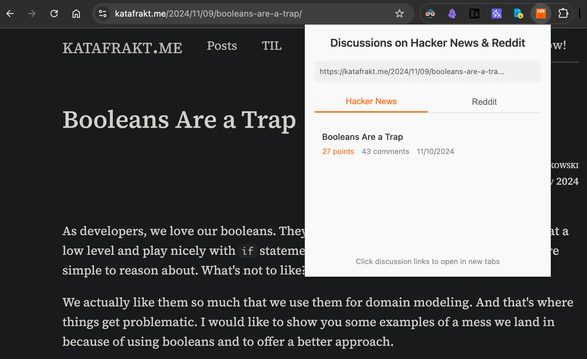

# Find HN & Reddit Discussions

[](https://opensource.org/licenses/MIT)

English | [简体中文](README.zh-CN.md)

> [!WARNING]
> Current code is fully generated by [Manus AI](https://manus.im/share/eYUyMrZE7g9ht29iUCygGk?replay=1), please use with caution and be aware of the risks.

A simple Chrome Extension that quickly finds relevant discussions on Hacker News (HN) and Reddit for the webpage you are currently viewing. Stop manually searching – get community insights with one click!



## Features

- **Find Discussions:** Automatically searches for discussions related to the current tab's URL on Hacker News and Reddit.
- **Platform Tabs:** Easily switch between Hacker News and Reddit results within the popup.
- **Relevant Information:** Displays discussion titles, points/score, comment counts, and submission dates.
- **Direct Links:** Click on any discussion title to open the corresponding HN or Reddit thread in a new tab.
- **Clean UI:** Simple and intuitive interface showing the current URL being checked.
- **Status Indicators:** Clear loading and error messages.
- **Manifest V3:** Built using the modern Chrome Extension platform standard.

## Installation

### For Development / Testing

1. **Clone the repository:**

   ```bash
   git clone https://github.com/corenel/find-hn-reddit-discussions.git
   # Or download the ZIP and extract it
   ```

2. **Open Chrome Extensions:** Navigate to `chrome://extensions` in your Chrome browser.
3. **Enable Developer Mode:** Toggle the "Developer mode" switch in the top-right corner.
4. **Load Unpacked:** Click the "Load unpacked" button and select the `chrome-extension-hn-reddit` folder (the one containing `manifest.json`).
5. The extension icon (HN/R) should appear in your toolbar.

### From Chrome Web Store (Future)

- *(Once published)* You will be able to install this extension directly from the Chrome Web Store. [Link Placeholder]

## Usage

1. Navigate to any webpage you're interested in.
2. Click the "HN & Reddit Discussions" extension icon in your Chrome toolbar.
3. The popup will appear, showing the current URL and attempting to fetch discussions.
4. View results under the "Hacker News" or "Reddit" tabs.
5. Click on a discussion title to open it.

## Technology Stack

- **Manifest Version:** 3
- **Frontend:** HTML, CSS, JavaScript
- **APIs:**
  - Hacker News Algolia Search API (`https://hn.algolia.com/api/v1/search`)
  - Reddit Search API (`https://www.reddit.com/search.json`)
- **Core Chrome APIs:** `chrome.tabs`, `chrome.runtime`

## Development Notes

- The extension uses a simple background service worker (`js/background.js`) primarily for install events.
- All core logic for fetching and displaying data resides in `js/popup.js`.
- Styling is handled by `css/popup.css`.
- Icons are provided in PNG format (generated from SVGs, potentially using `js/create-icons.js` and `create-icons.html` as utility tools during development).
- Debugging:
  - **Popup:** Right-click the extension icon -> Inspect Popup.
  - **Background Service Worker:** Go to `chrome://extensions`, find the extension, click the "Service Worker" link.

## Contributing

Contributions are welcome! Please feel free to submit a Pull Request or open an Issue.

## License

This project is licensed under the MIT License - see the [LICENSE](LICENSE) file for details.
