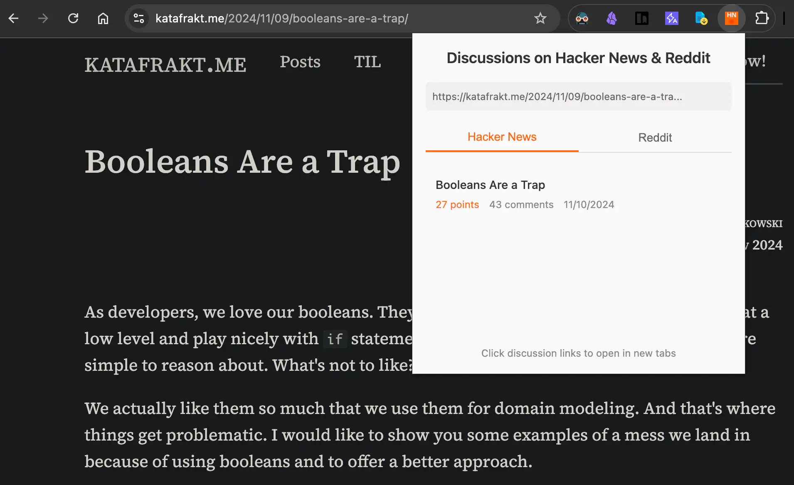

# 查找 HN 与 Reddit 讨论

[](https://opensource.org/licenses/MIT)

[English](README.md) | 简体中文

> [!WARNING]
> 当前该项目的代码完全由 [Manus AI](https://manus.im/share/eYUyMrZE7g9ht29iUCygGk?replay=1) 生成，未经审查，请谨慎使用并注意风险。

一个简洁的 Chrome 扩展程序，可以为您当前正在浏览的网页快速查找 Hacker News (HN) 和 Reddit 上的相关讨论。无需手动搜索，一键获取社区见解！



## 功能特性

- **查找讨论：** 自动在 Hacker News 和 Reddit 上搜索与当前标签页 URL 相关的讨论串。
- **平台标签页：** 在弹出窗口中轻松切换 Hacker News 和 Reddit 的搜索结果。
- **相关信息：** 显示讨论标题、得分/点赞数、评论数和发布日期。
- **直接链接：** 点击任何讨论标题，即可在新标签页中打开对应的 HN 或 Reddit 帖子。
- **简洁界面：** 简单直观的界面，显示正在检查的当前 URL。
- **状态指示：** 清晰的加载中和错误信息提示。
- **Manifest V3：** 使用现代 Chrome 扩展平台标准构建。

## 安装

### 用于开发/测试

1. **克隆仓库：**

   ```bash
   git clone https://github.com/corenel/find-hn-reddit-discussions.git
   # 或者下载 ZIP 文件并解压
   ```

2. **打开 Chrome 扩展程序：** 在 Chrome 浏览器中访问 `chrome://extensions`。
3. **启用开发者模式：** 打开右上角的“开发者模式”开关。
4. **加载已解压的扩展程序：** 点击“加载已解压的扩展程序”按钮，然后选择 `chrome-extension-hn-reddit` 文件夹（包含 `manifest.json` 的那个）。
5. 扩展程序的图标（HN/R）应该会出现在您的工具栏中。

### 从 Chrome 应用商店安装 (发布后)

- *(发布后)* 您将能够直接从 Chrome 应用商店安装此扩展程序。[链接占位符]

## 使用

1. 导航到您感兴趣的任何网页。
2. 点击 Chrome 工具栏中的“HN & Reddit Discussions”扩展程序图标。
3. 弹出窗口将显示当前 URL 并尝试获取讨论。
4. 在“Hacker News”或“Reddit”标签页下查看结果。
5. 点击讨论标题即可在新标签页中打开对应的 HN 或 Reddit 帖子。

## 技术栈

- **Manifest 版本：** 3
- **前端：** HTML, CSS, JavaScript
- **API：**
  - Hacker News Algolia 搜索 API (`https://hn.algolia.com/api/v1/search`)
  - Reddit 搜索 API (`https://www.reddit.com/search.json`)
- **核心 Chrome API：** `chrome.tabs`, `chrome.runtime`

## 开发笔记

- 扩展使用简单的后台服务工作者 (`js/background.js`) 主要用于安装事件。
- 所有核心逻辑（如数据获取和显示）都位于 `js/popup.js` 中。
- 样式由 `css/popup.css` 处理。
- 图标以 PNG 格式提供（从 SVG 生成，可能在开发过程中使用 `js/create-icons.js` 和 `create-icons.html` 作为实用工具）。
- 调试：
  - **弹出窗口：** 右键点击扩展图标 -> 检查弹出窗口。
  - **后台服务工作者：** 前往 `chrome://extensions`，找到扩展程序，点击“服务工作者”链接。

## 贡献

欢迎提交 Pull Request 或打开 Issue。

## 许可证

此项目使用 MIT 许可证 - 查看 [LICENSE](LICENSE) 文件了解更多信息。
